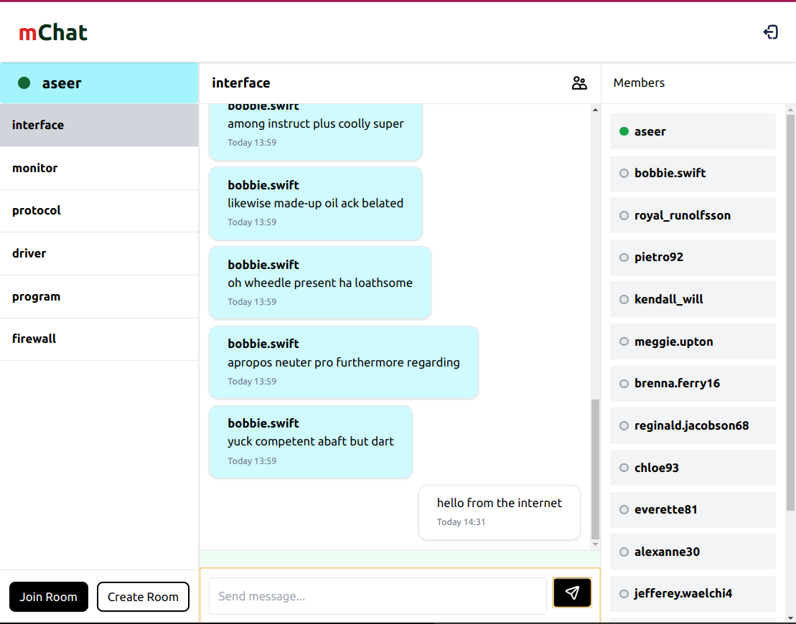

# mChat

> Real-time messenger powered by Socket.IO



## Pre requisites

- Node.js v20
- PNPM
- Docker

## Tech Stacks

- Frontend - React.js, TailwindCSS
- Backend - Express, socket.io, MongoDB, Redis

## Get Started

### Run final build using docker compose

- Spin up entire stack (redis, mongo, web, server)
```bash
docker compose -f docker-compose.prod.yml up --build
```
- Go to [http://localhost:3000](http://localhost:3000)

### Development

- Spin up MongoDB and Redis
```bash
docker compose up -d
```

> Make sure the ports (mongo: 27017, redis: 6379) are open for connection

- Install dependencies
```bash
pnpm i
```

- Run development server (web & server)
```bash
pnpm dev
```

- Go to [http://localhost:3000](http://localhost:3000)

- (Optional) Seed database
```bash
pnpm --filter server seed
```

### E2E testing

- Run playwright e2e tests
```bash
pnpm --filter e2e test
```
- Run playwright e2e tests in UI mode
```bash
pnpm --filter e2e test:ui
```
- Run playwright e2e test generator
```bash
pnpm --filter e2e test:codegen
```

## Features Roadmap


### primary goals

- [x] sign up, login and logout
- [x] jwt user authentication/authorization
- [x] create group
- [x] join groups
- [x] realtime messaging
- [x] typing indicators
- [x] socket.io cluster adapter integration
- [x] global error handling
- [x] redis implementation (typing users, online users)
- [x] online status
- [x] realtime member list update
- [x] infinite scroll pagination (messages/groups/members)
- [x] tanstack react-query integration 
- [ ] alert component
- [ ] confirm dialog
- [ ] delete group
- [ ] e2e encryption
- [ ] read receipts
- [ ] extract db operation to dao

### extras

- [x] playwright e2e tests for chat
- [ ] swagger ui
- [ ] switch to postgresql (support transaction)
- [ ] keploy api test generation
- [ ] private groups - invite
- [ ] notifications
- [ ] socket.io redis streams adapter integration

## Authors

- Aseer KT - [aseerkt.com](https://aseerkt.com)