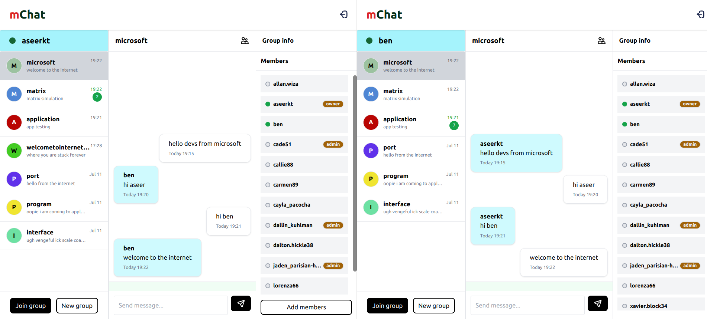

# mChat

> Real-time messenger powered by Socket.IO



## Pre requisites

- Node.js v20
- PNPM
- Docker (dragonflydb - 3.5GB memory / 4 cores)

## Tech Stacks

- Frontend - React.js, TailwindCSS, React-Query
- Backend - Express, socket.io, PostgreSQL, DragonflyDB

## Get Started

### Run final build using docker compose

- Spin up the entire stack (DragonflyDB, PostgreSQL, React.js, Node.js)
```bash
pnpm docker:up
```
> Make sure ports `6379`,`5432`,`5000` and `3000` are not occupied
- Run migrations
```bash
pnpm docker:db:migrate
```
- Seed database
```bash
pnpm docker:db:seed
```
- Go to [http://localhost:3000](http://localhost:3000)

- Stop docker containers
```bash
pnpm docker:down
```

### Development

- Spin up PostgreSQL and DragonflyDB
```bash
docker compose up -d
```

> Make sure the ports (postgres: 5432, dragonfly: 6379) are open for connection

- Install dependencies
```bash
pnpm i
```

- Run migrations
```bash
pnpm --filter server migration:run
```

- (Optional) Seed database
```bash
pnpm --filter server seed
```

- Run development server (web & server)
```bash
pnpm dev
```

- Go to [http://localhost:3000](http://localhost:3000)


### E2E testing

- Run playwright e2e tests
```bash
pnpm e2e:test
```
- Run playwright e2e tests in UI mode
```bash
pnpm --filter e2e test:ui
```
- Run playwright e2e test generator
```bash
pnpm --filter e2e test:codegen
```

### Unit testing

- Run web unit tests
```bash
pnpm --filter web test
```


## Features Roadmap

### primary goals

- [x] sign up, login and logout
- [x] jwt user authentication/authorization
- [x] create group
- [x] join groups
- [x] realtime messaging
- [x] typing indicators
- [x] socket.io cluster adapter integration
- [x] dragonflydb implementation (typing users, online users)
- [x] member online status
- [x] realtime member list update
- [x] infinite scroll cursor pagination (messages/groups/members)
- [x] tanstack react-query integration 
- [x] add members
- [x] realtime unread count 
- [x] leave group, transfer ownership, delete group
- [x] delete group
- [x] alert component
- [x] direct message 
- [x] delete message
- [x] reply to message
- [x] date separator   
- [x] confirm dialog
- [x] message receipts
- [ ] e2e encryption

### extras

- [x] playwright e2e tests for chat
- [x] switch to postgresql (support transaction)
- [x] minimal swagger ui
- [ ] keploy api test generation
- [ ] private groups - invite/add/delete members
- [ ] notifications

## Authors

- Aseer KT - [aseerkt.com](https://aseerkt.com)